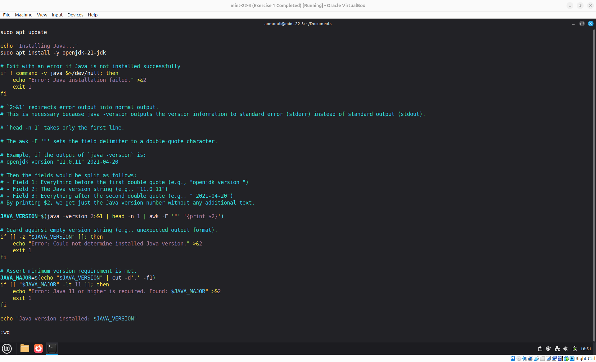
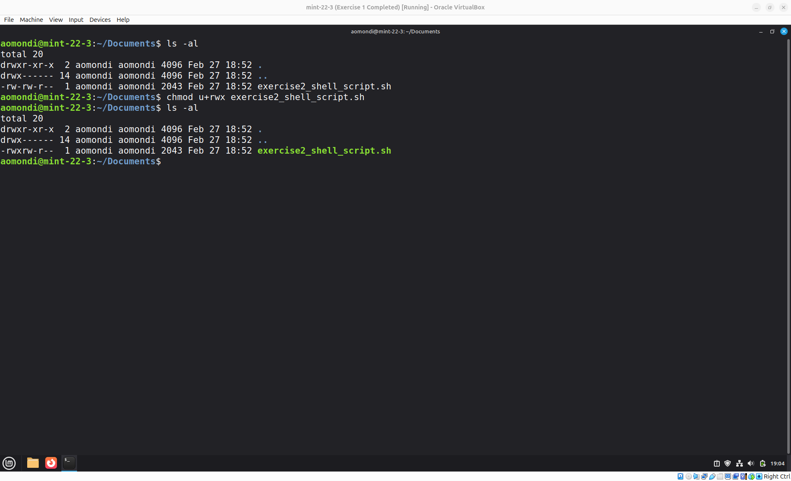
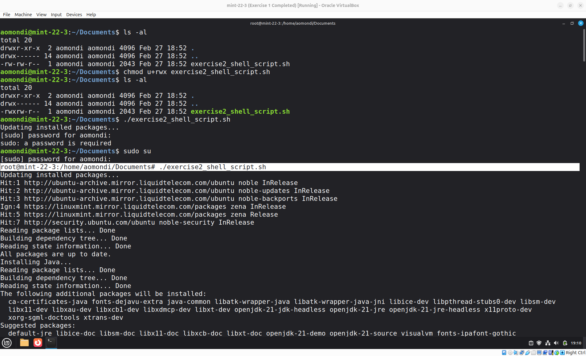
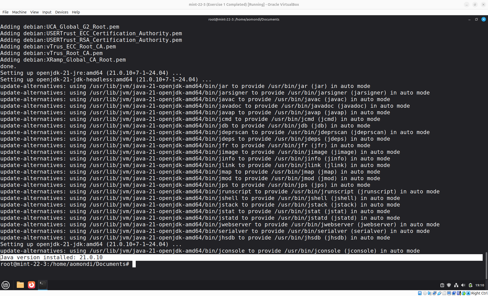

# Exercise 2: Bash Script - Install Java

## Question

Write a bash script using Vim editor that installs the latest java version and checks whether java was installed successfully by executing a `java -version` command.

After installation command, it checks 3 conditions:

    1. whether java is installed at all
    2. whether an older Java version is installed (java version lower than 11)
    3. whether a java version of 11 or higher was installed

It prints relevant informative messages for all 3 conditions. Installation was successful if the 3rd condition is met and you have Java version 11 or higher available.

*Hint: The `awk` command helps process text by letting you extract specific parts of each line, using spaces or other characters as dividers between those parts.*

As an example: `echo "apple banana cherry" | awk '{print $2}'`

Would output: `banana`

You can see more examples here: [https://www.tutorialspoint.com/awk/awk_basic_examples](https://www.tutorialspoint.com/awk/awk_basic_examples)

## Answers

- Step 1: Install Vim

    

- Step 2: Create the Bash Script using Vim

    

    Link to Shell (Bash) Script: [exercise2_shell_script.sh](exercise2_shell_script.sh)

- Step 3: Set the Required Permissions

    `chmod u+rwx exercise2_shell_script.sh`

    

- Step 4: Execute the Bash Script

    Run ` ./exercise2_shell_script.sh`

    

    Successfully installed Java version 21.0.10

    
