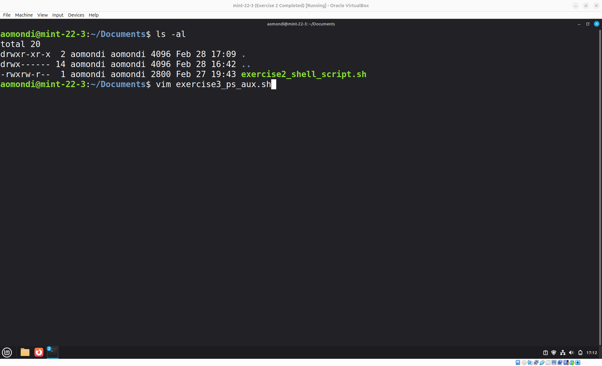
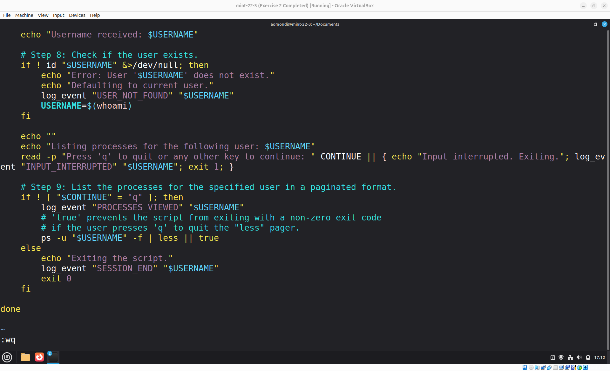
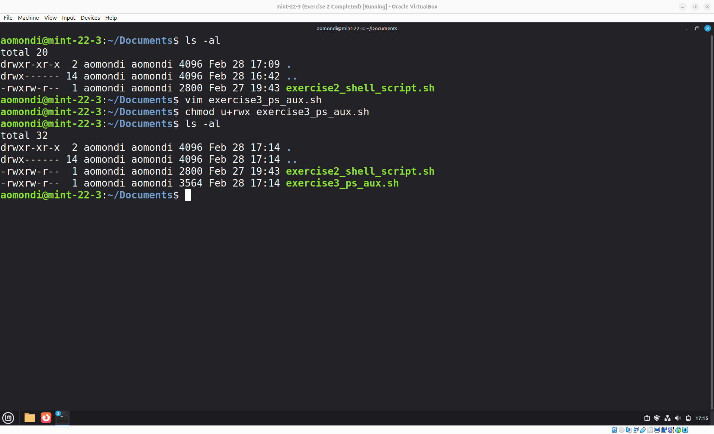
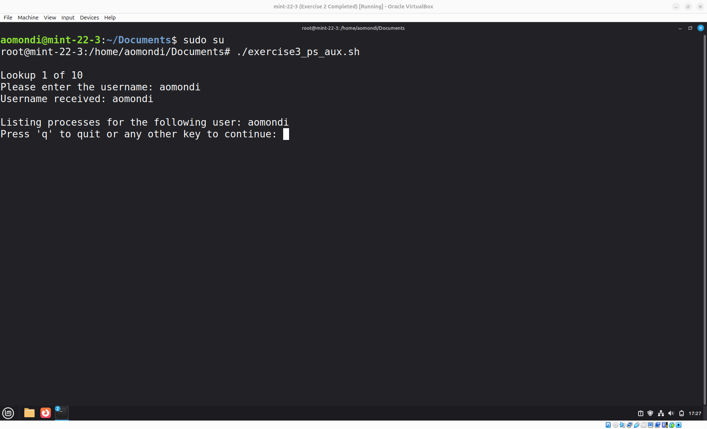
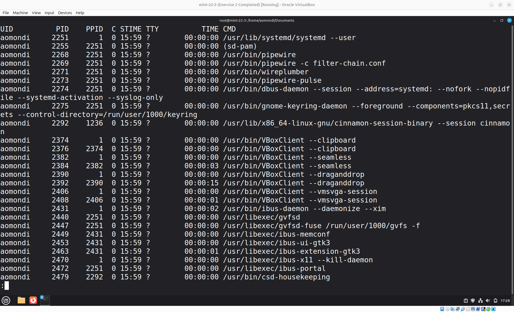

# Exercise 3: Bash Script - User Processes

## Question

Write a bash script using Vim editor that checks all the processes running for the current user (`USER env var`) and prints out the processes in console. Hint: use `ps aux` command and `grep` for the user.

## Answers


- Step 1: Create the Bash Script using Vim

    

    Add Content to Script using Vim:
    

    Link to bash script: [exercise3_ps_aux.sh](exercise3_ps_aux.sh)

- Step 2: Set the required permissions to execute the script

    

- Step 3: Execute the script

    Executed using:

    ```shell
    sudo su
    ./exercise3_ps_aux.sh
    ```

    

    
