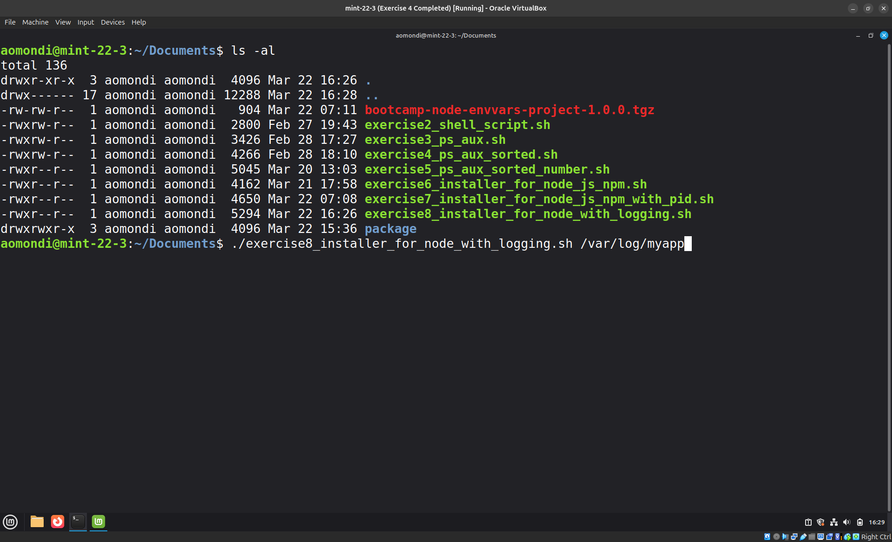
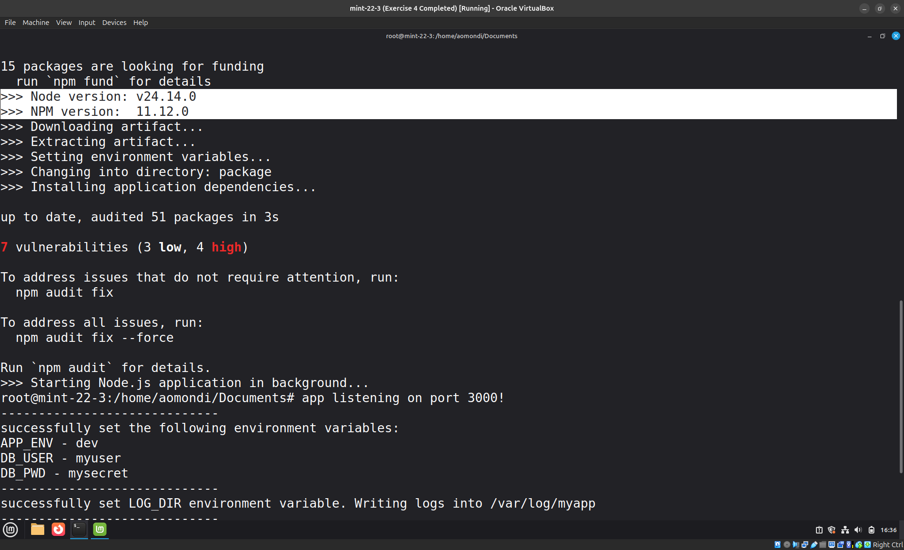
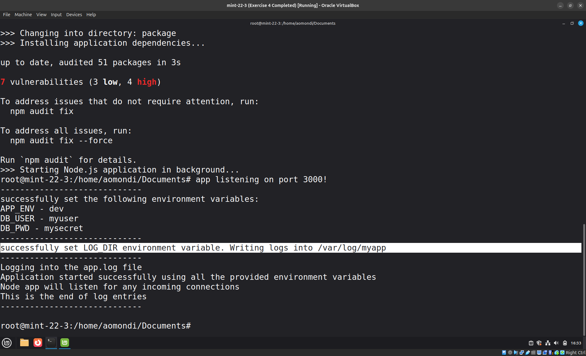

# Exercise 8: Bash Script - Node App with Log Directory

## Question

Extend the script to accept a parameter input `log_directory`: a directory where the application will write logs.

The script will check whether the parameter value is a directory name that doesn't exist and will create the directory, if it does exist, it sets the `env` var `LOG_DIR` to the directory's absolute path before running the application, so the application can read the `LOG_DIR` environment variable and write its logs there.

Note:

- Check the `app.log` file in the provided `LOG_DIR` directory.
- This is what the output of running the application must look like: [node-app-output.png](https://uploads.teachablecdn.com/attachments/h2wkTpjnQfeJOt1Ho8Km_node-app-output.png)

## Answers


- Step 1: Execute the script with the `log_directory` parameter

    

    Link to bash script: [exercise8_installer_for_node_with_logging.sh](exercise8_installer_for_node_with_logging.sh)

- Step 2: Confirmation of the `LOG_DIR` environment variable being set to the provided directory path, and that the application is running with the correct environment variable.

    Executed using:

    ```shell
    sudo su
    ./exercise8_installer_for_node_with_logging.sh /var/log/myapp
    ```

    

    
