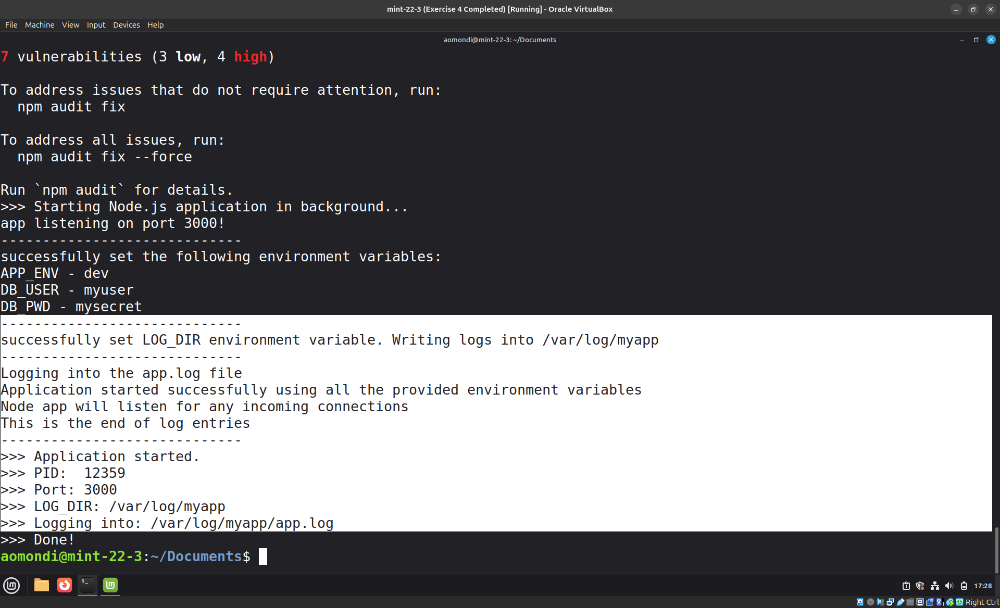

# Exercise 9: Bash Script - Node App with Service user

## Question

You've been running the application with your user. But we need to adjust that and create own service user: `myapp` for the application to run. So extend the script to create the user and then run the application with the service user.

## Answers


- Step 1: Execute the edited script with the `log_directory` parameter

    

    Link to bash script: [exercise9_installer_for_node_with_adduser_and_logging.sh](exercise9_installer_for_node_with_adduser_and_logging.sh)
- Step 2: Confirmation of the `LOG_DIR` environment variable being set to the provided directory path, and that the application is running with the correct environment variable.

    Executed using:

    ```shell
    sudo su
    ./exercise8_installer_for_node_with_logging.sh /var/log/myapp
    ```

    

    

    Uninstall script executed using:

    ```shell
    sudo su
    ./exercise8_installer_for_node_with_logging.sh /var/log/myapp
    ```
