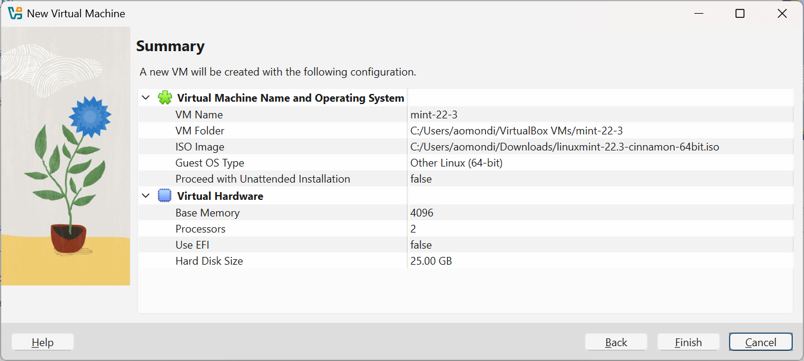
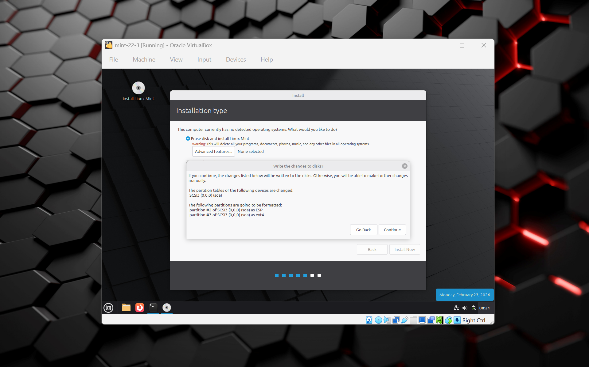
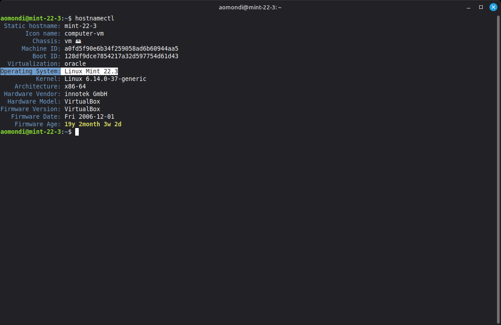
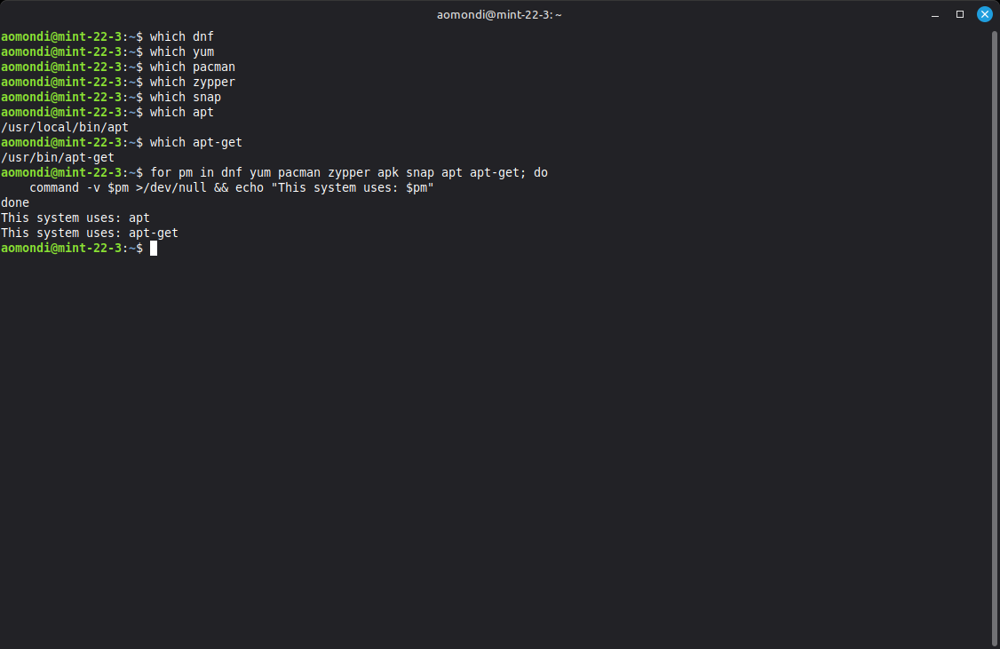
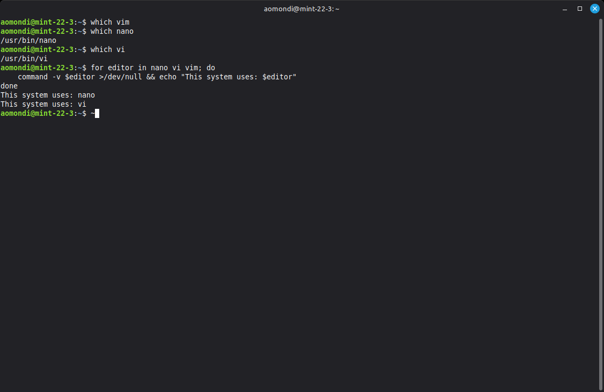
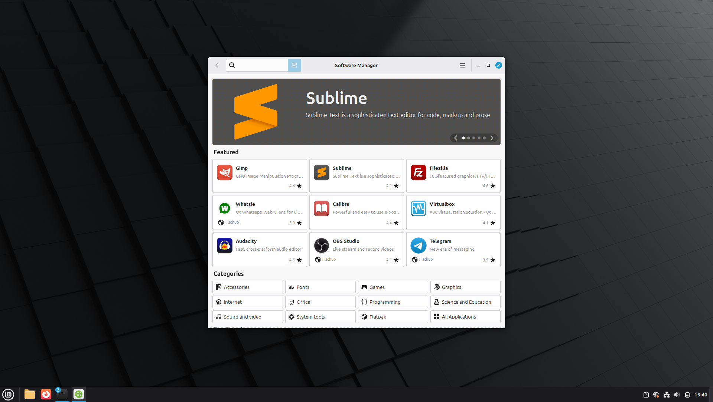
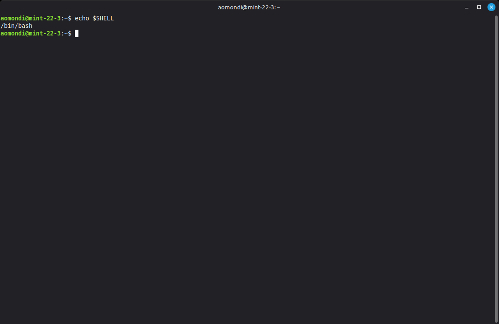
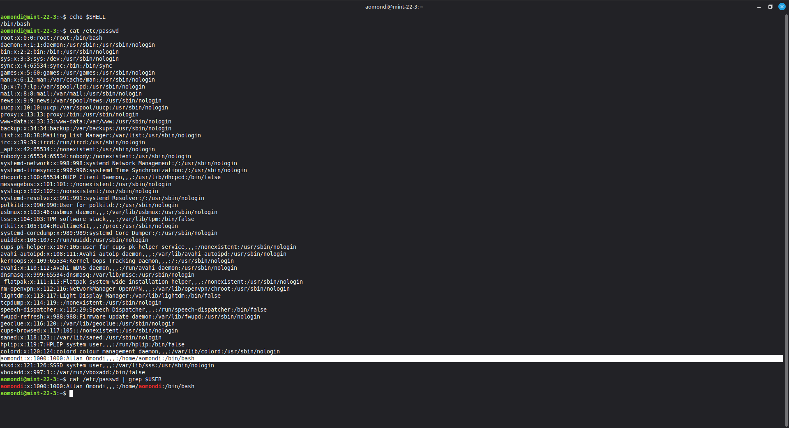

# Exercise 1: Linux Mint Virtual Machine

## Question

Create a Linux Mint Virtual Machine on your computer. Check the distribution, which package manager it uses (yum, apt, apt-get). Which CLI editor is configured (Nano, Vi, Vim). What software center/software manager it uses. Which shell is configured for your user.

## Answers

[](https://linuxmint.com/edition.php?id=326)

- Step 1: Downloaded Linux Mint 22.3 Cinnamon Edition from: [https://linuxmint.com/edition.php?id=326](https://linuxmint.com/edition.php?id=326)

- Step 2: Created a new Virtual Machine in VirtualBox and installed Linux Mint using the downloaded ISO file.

  - Base Memory: 4096 MB
  - Number of CPUs: 2
  - Disk Size: 25 GB (dynamically allocated)
  - Network: Bridged Adapter
  - Other settings: Shared clipboard: bidirectional, drag and drop: bidirectional, Oracle VirtualBox Extension Pack installed

    

- Step 3: Installed Linux Mint

    

### Distribution

- Step 4: Check the distribution

  - Distribution: Linux Mint 22.3 Cinnamon Edition

    ```shell
    hostnamectl
    ```

    

### Package Manager

- Step 5: Check the package manager

  - Linux Mint uses the **APT** and **APT-GET** package managers.

    ```shell
    which dnf
    which yum
    which pacman
    which zypper
    which apt
    which apt-get
    ```

  - `/dev/null` contains the null device, which discards all data written to it and provides no data when read. By redirecting the output to `/dev/null`, we suppress any output that would normally be displayed if the command is found or not found. This allows us to check for the presence of multiple package managers without cluttering the terminal with unnecessary output.

    ```shell
    for pm in dnf yum pacman zypper apk snap apt apt-get; do
        command -v $pm >/dev/null && echo "This system uses: $pm"
    done
    ```

    

### CLI Editor

- Step 6: Check the CLI editor

  - Linux Mint uses **Nano** and **Vi** as the CLI editors.

    ```shell
    which vim
    which nano
    which vi
    ```

    ```shell
    for editor in nano vi vim; do
        command -v $editor >/dev/null && echo "This system uses: $editor"
    done
    ```

    

### Software Center/Software Manager

- Step 7: Check the software center/software manager

  - Linux Mint uses **Software Manager** as its software center.

    

### Shell

- Step 8: Check the shell

  - Linux Mint uses **Bash** as the default shell.

    ```shell
    echo $SHELL
    ```

    

  - or

    ```shell
    cat /etc/passwd
    ```

  - or

    ```shell
    cat /etc/passwd | grep $USER
    ```

    
