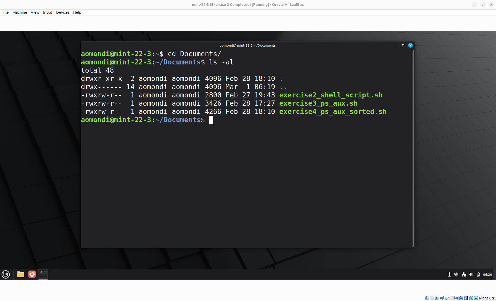
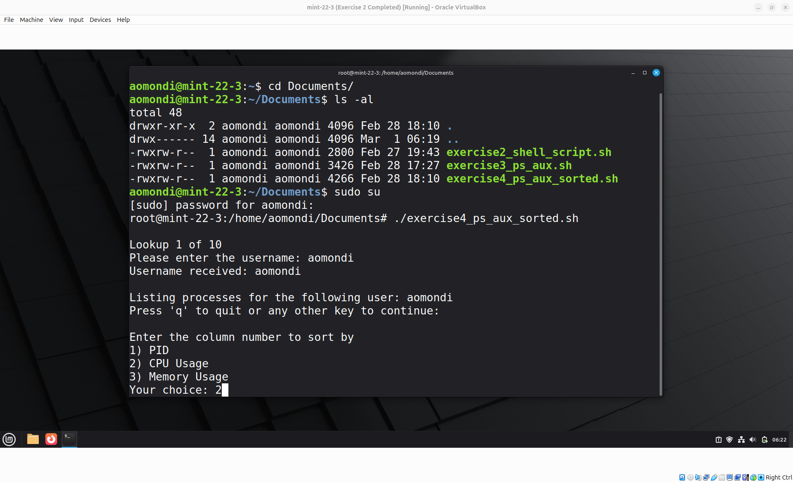
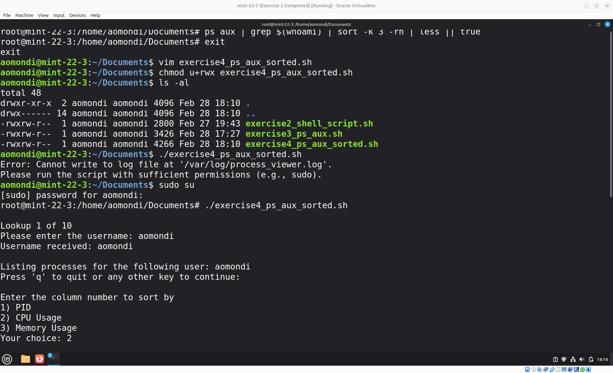
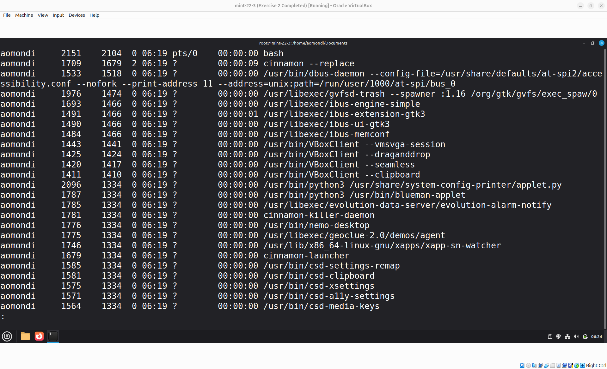

# Exercise 4: Bash Script - User Processes Sorted

## Question

Extend the previous script to ask for a user input for sorting the processes output either by memory or CPU consumption, and print the sorted list.

## Answers


- Step 1: Create the Bash Script using Vim and make it Executable

    

    

    Link to bash script: [exercise4_ps_aux_sorted.sh](exercise4_ps_aux_sorted.sh)

- Step 2: Execute the script

    Executed using:

    ```shell
    sudo su
    ./exercise4_ps_aux_sorted.sh
    ```

    

    
