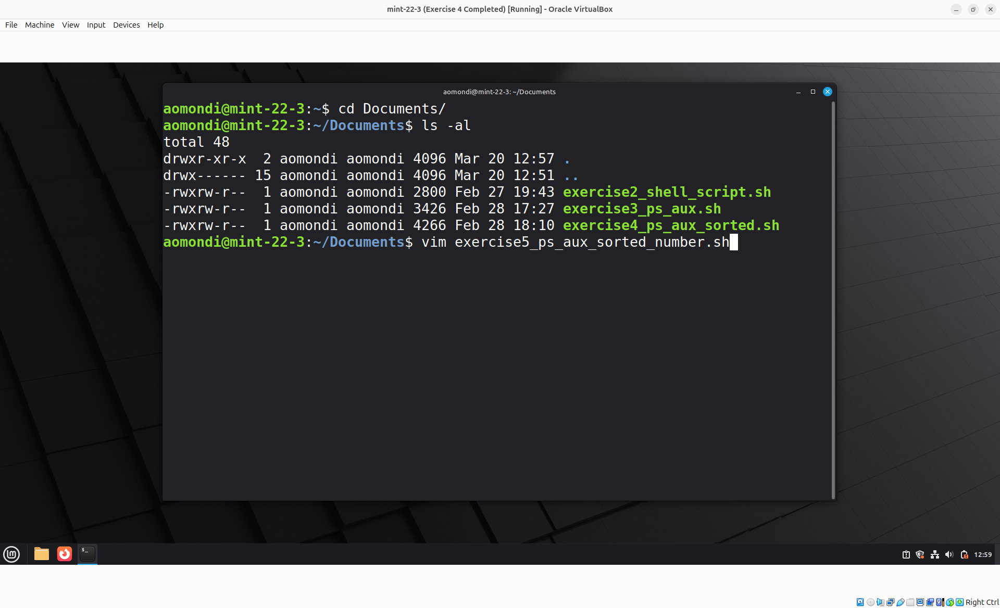
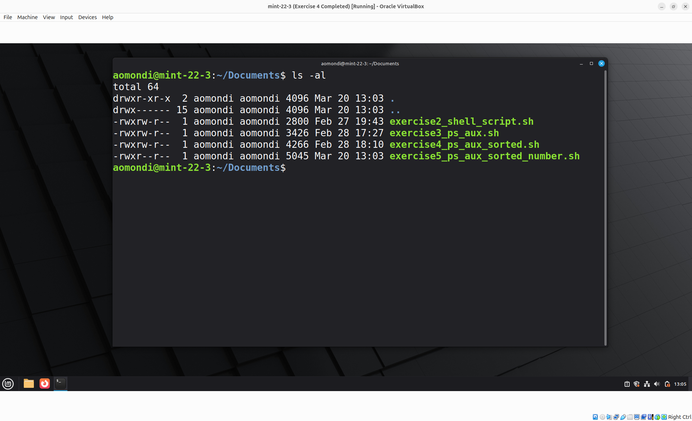
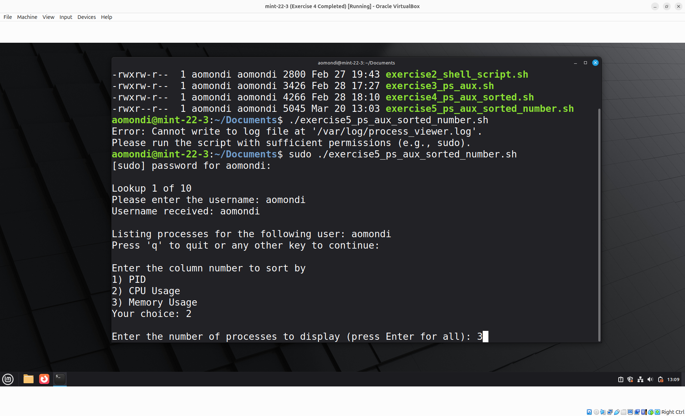
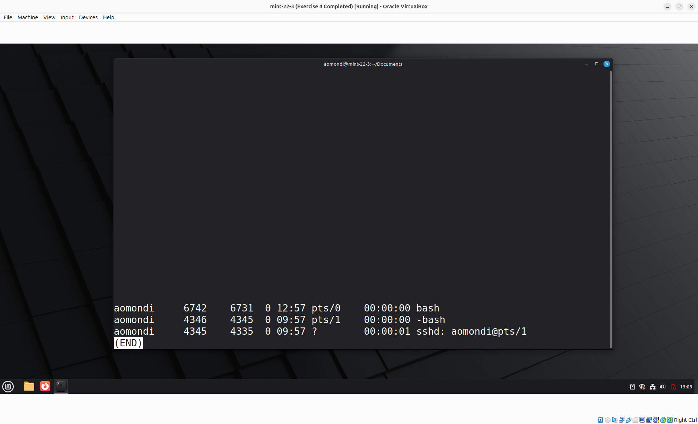

# Exercise 5: Bash Script - Specific Number of User Processes Sorted

## Question

Extend the previous script to ask additionally for user input about how many processes to print. *Hint: use `head` program to limit the number of outputs.*

## Answers


- Step 1: Create the Bash Script using Vim and make it Executable

    

    

    Link to bash script: [exercise5_ps_aux_sorted_number.sh](exercise5_ps_aux_sorted_number.sh)

- Step 2: Execute the script

    Executed using:

    ```shell
    sudo su
    ./exercise5_ps_aux_sorted_number.sh
    ```

    

    
