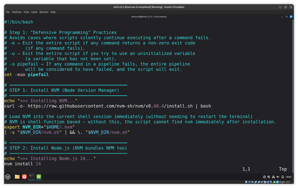
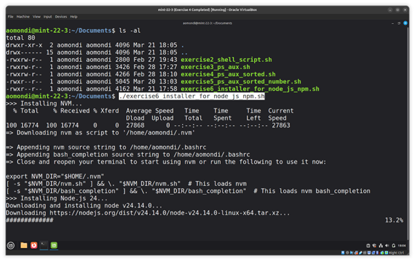
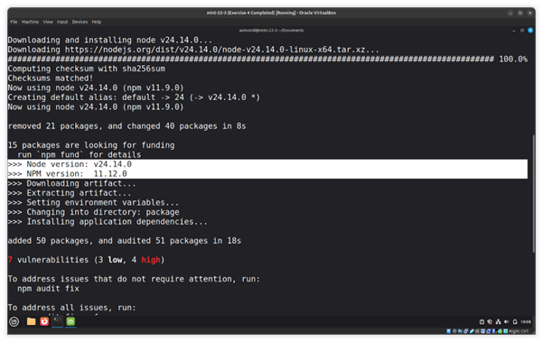
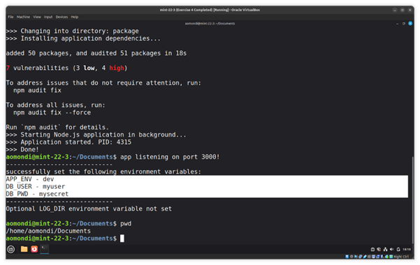

# Exercise 6: Bash Script - Start Node App

## Question

Write a bash script with following logic:

- Install NodeJS and NPM and print out which versions were installed
- Download an artifact file from the URL: [https://node-envvars-artifact.s3.eu-west-2.amazonaws.com/bootcamp-node-envvars-project-1.0.0.tgz](https://node-envvars-artifact.s3.eu-west-2.amazonaws.com/bootcamp-node-envvars-project-1.0.0.tgz) *Hint: use curl or wget*

  - Unzip the downloaded file
  - Set the following needed environment variables:
    - `APP_ENV=dev`
    - `DB_USER=myuser`
    - `DB_PWD=mysecret`
  - Change into the unzipped package directory
  - Run the NodeJS application by executing the following commands:  npm install and node server.js

Notes:

- Make sure to run the application in background so that it doesn't block the terminal session where you execute the shell script
- If any of the variables is not set, the node app will print error message that env vars is not set and exit
- It will give you a warning about LOG_DIR variable not set. You can ignore it for now.

## Answers


- Step 1: Install NodeJS and NPM and print out which versions were installed

    

    

    

    Link to bash script: [exercise6_installer_for_node_js_npm.sh](exercise6_installer_for_node_js_npm.sh)

- Step 2: Download the artifact file, unzip it, set environment variables, and run the NodeJS application in the background

    Executed using:

    ```shell
    sudo su
    ./exercise6_installer_for_node_js_npm.sh
    ```

    
