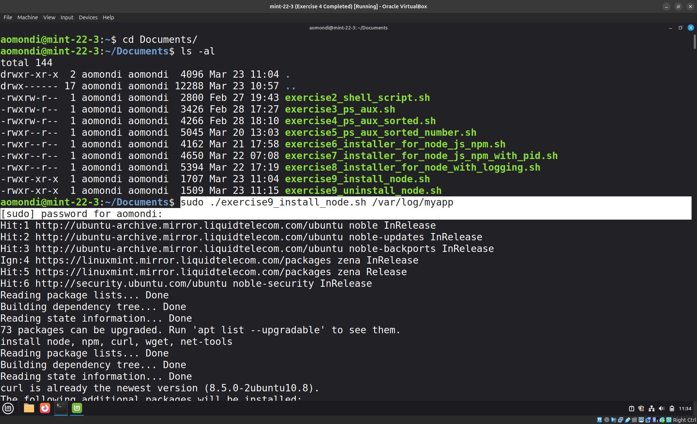
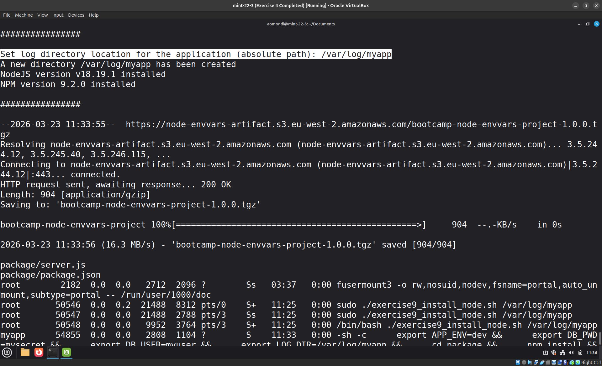

# Exercise 9: Bash Script - Node App with Service user

## Question

You've been running the application with your user. But we need to adjust that and create own service user: `myapp` for the application to run. So extend the script to create the user and then run the application with the service user.

## Answers


- Screenshots:

    Execution command:

    ```shell
    sudo ./exercise9_uninstall_node.sh
    ```

    Link to bash script: [exercise9_install_node.sh](exercise9_install_node.sh)

    Link to uninstall bash script: [exercise9_uninstall_node.sh](exercise9_uninstall_node.sh)

    Execute the script:
    

    Set the log path:
    

    Confirmation of running app:
    
